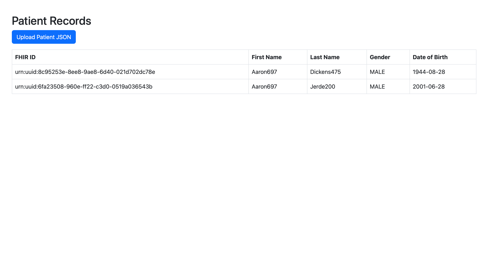

# FHIR Normaliser

A production-grade Spring Boot application for ingesting and transforming HL7 FHIR Patient resources from JSON bundles into a relational database, with a web interface for viewing and uploading data.

---


## ✨ Features

- Upload and parse HL7 FHIR Patient bundles (JSON)
- Persist data into a PostgreSQL database
- View patient data via a responsive web UI
- Built-in validation and feedback handling
- RESTful API design
- Dockerised and ready for production deployment

---

## 📦 Tech Stack

- Java 21
- Spring Boot 3.5
- PostgreSQL
- Thymeleaf
- Bootstrap 5
- MapStruct + Lombok
- Docker & Docker Compose

---

## 📸 Interface Preview

> *Easy-on-the-eye UI*

---

## ⚙️ Installation

### Prerequisites
- Java 21
- Docker + Docker Compose

### Clone & Build
```bash
git clone https://github.com/your-org/fhir-normaliser.git
cd fhir-normaliser
./mvnw clean package -DskipTests
```

### Run with Docker Compose
```bash
docker-compose up --build
```

Visit: [http://localhost:8081/api/view/patients](http://localhost:8081/api/view/patients)

---

## 📂 API Endpoints

### POST `/api/fhir/bundle`
Upload a JSON bundle of FHIR Patient resources.

**Request:**
```bash
curl -X POST \
  -H "Content-Type: application/json" \
  --data @valid-patient.json \
  http://localhost:8081/api/fhir/bundle
```

**Response:**

`201 CREATED` with a JSON array of patient objects.

**Example Response:**
```json
{
  "status": "success",
  "message": "2 patients successfully parsed"
}
```

**Use case:**
Ideal for API consumers that want to batch load FHIR patient data in to the pipeline.


### GET `/api/data/patients`

Retrieves a list of all normalised patients in the system as JSON.

**Request:**
```bash
curl -X GET http://localhost:8081/api/data/patients
```

**Response:**

`200 OK` with a JSON array of patient objects.

**Example Response:**
```json
[
  {
    "fhirId": "patient-123",
    "name": "John Smith",
    "gender": "MALE",
    "birthDate": "1944-08-28",
    "address": "123 Example Street"
  },
  {
    "fhirId": "patient-456",
    "name": "Jane Doe",
    "gender": "FEMALE",
    "birthDate": "1970-12-01",
    "address": "456 Sample Avenue"
  }
]
```

**Use case:**
Ideal for frontend clients or API consumers that want to fetch patient data in a machine-readable format.


---

## 🧪 Running Tests
```bash
./mvnw test
```
Includes:
- Unit tests for service layers
- Integration tests for REST endpoints

---

## 🛠 Development Notes

### Environment Setup
- Local DB: `patientdata`
- User: `normaliser` / `N0rm4l!zer`

### Add FHIR Bundles
Place test files in: `src/test/resources/bundles/`

---

## 🧭 Roadmap

- [x] Parse and persist FHIR patients
- [x] Web UI for patient data
- [x] Modal-based upload with feedback
- [ ] Add authentication & role-based access
- [ ] Expand support for additional FHIR resources
- [ ] CI/CD pipeline integration

---

## 🤝 Contributing

1. Fork the repo
2. Create your feature branch: `git checkout -b feature/new-feature`
3. Commit your changes: `git commit -m 'Add new feature'`
4. Push to the branch: `git push origin feature/new-feature`
5. Open a Pull Request

---

## ✍️ Author

Developed by **Cabdulrazaq Mohamed**  
GitHub: [@cabzmo](https://github.com/cabzmo)

---